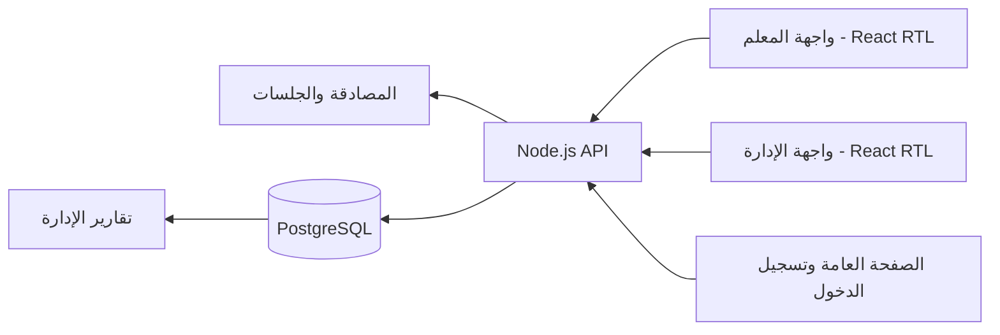

# معمارية منصة إحياء

## المخطط المبسط



## الكيانات الرئيسية

| الكيان | الجدول | العلاقة |
| --- | --- | --- |
| المستخدم | `users` | يحمل الدور `admin` أو `teacher` وبيانات الدخول. |
| المعلم | `users` بدور `teacher` | يسند إلى حلقة عبر `circles.teacher_user_id`. |
| الحلقة | `circles` | تضم طلابًا، ولها معلم وأيام انعقاد. |
| الطالب | `students` | ينتمي إلى حلقة حالية عبر `circle_id`. |
| جلسة الحلقة | `attendance_sessions` | جلسة واحدة لكل حلقة وتاريخ. |
| الحضور | `attendance_records` | سجل واحد لكل طالب داخل جلسة. |
| متابعة القرآن | `quran_records` | سجل واحد لكل طالب وتاريخ، ويرتبط بالجلسة عند وجودها. |
| انتقال الطالب | `student_transfer_history` | يحتفظ بـ «من/إلى» ومنفذ النقل وتاريخه. |
| جلسة الدخول | `user_sessions` | Token مُهشّم وتاريخ انتهاء للمصادقة. |

العلاقات الأساسية:

```text
users (teacher) 1 ── * circles 1 ── * students
circles 1 ── * attendance_sessions 1 ── * attendance_records * ── 1 students
attendance_sessions 1 ── * quran_records * ── 1 students
students 1 ── * student_transfer_history
```

## تدفق البيانات

1. يسجل المعلم الدخول؛ يتحقق API من الدور ويقرأ الحلقات المسندة فقط.
2. يفتح المعلم تاريخًا: API يجلب طلاب الحلقة والسجل المحفوظ لذلك اليوم.
3. عند الحفظ ينشئ API جلسة الحلقة تلقائيًا إن لم توجد، ثم ينفذ **upsert** للحضور والتسميع داخل transaction.
4. تقرأ لوحة الإدارة الجداول نفسها عبر API؛ لا توجد طبقة Mock أو نسخ بيانات منفصلة.
5. التقارير والحضور والتنبيهات تبنى عبر استعلامات PostgreSQL من السجلات الفعلية.

## أسرار وإعدادات التشغيل

- يقرأ API ملف `.env` محليًا عبر `process.loadEnvFile` أو متغيرات بيئة الخادم.
- أهم القيم: `DATABASE_URL`, `APP_ORIGIN`, `PORT`, `HOST`, `COOKIE_SECURE`, `ATTENDANCE_START_DATE`.
- توجد مفاتيح الاتصال وكلمات المرور في بيئة الخادم فقط. لا تضع قيمًا حقيقية في docs أو المصدر أو GitHub.
- ملفات Sites في `.openai/`, `worker/`, و`dist` خاصة بقابلية الاستضافة، وليست مصدر أسرار الإنتاج.

## قواعد السلامة التقنية

- عمليات الكتابة تتحقق من الدور، وتتحقق عمليات المعلم من ملكية الحلقة.
- Cookies الجلسة `HttpOnly` و`Secure` في الإنتاج و`SameSite=Lax`.
- مسارات الكتابة تتحقق من `Origin` المطابق لـ `APP_ORIGIN`.
- أي تعديل للمخطط يضاف كمهاجرة جديدة؛ لا تعدّل تاريخ البيانات يدويًا من الواجهة أو قاعدة الإنتاج دون خطة استعادة.
